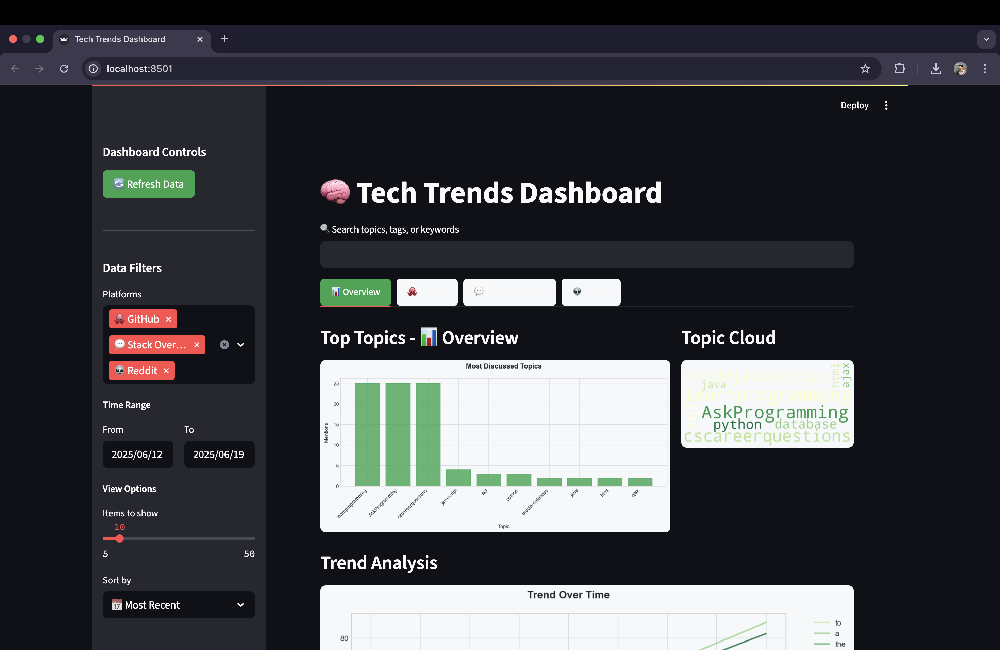
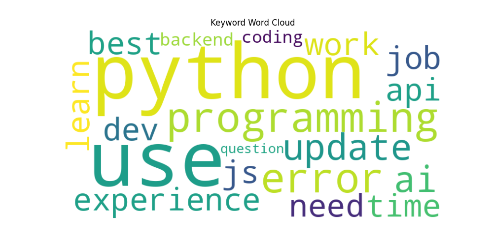
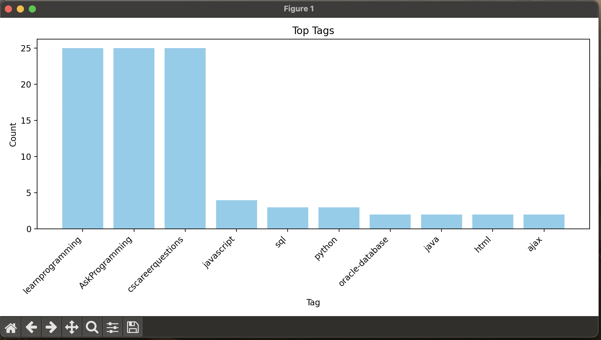
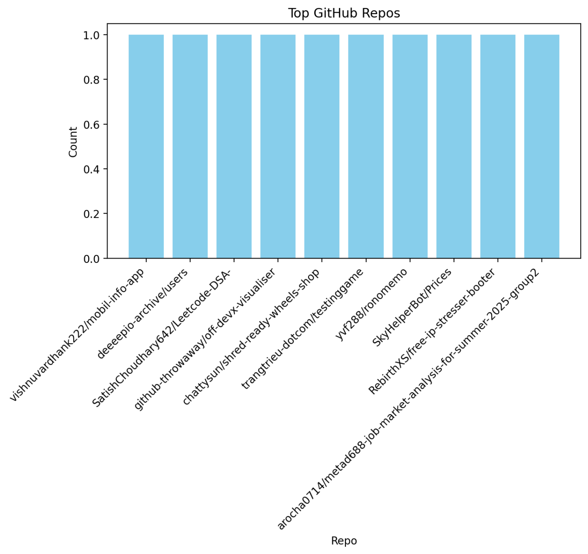

# Interactive Dashboard

This is the visual interface for exploring tech trends collected from GitHub, Stack Overflow, and Reddit. It provides an interactive way to analyze and visualize the data through a web-based dashboard.

## Features

### 1. Main Dashboard (`app.py`)
The central interface that:
- Displays trending topics and keywords
- Shows platform-specific data in separate tabs
- Provides search functionality across all data
- Includes real-time data refresh capabilities
- Auto-refreshes every 5 minutes


*Clean, GitHub-themed interface with intuitive navigation*

### 2. Chart Components (`charts.py`)
Various visualization types:
- **Bar Charts**: Display rankings and counts for keywords, tags, entities, and repositories
- **Word Clouds**: Visualize keyword importance and frequency
- **Line Charts**: Show trends over time
- **Data Tables**: Display detailed post/discussion information


*Interactive data visualization with GitHub-style color scheme*

### 3. Filter System (`filters.py`)
Data filtering capabilities:
- Platform selection (GitHub, Stack Overflow, Reddit)
- Date range filtering
- Top N results selection
- View type selection (by score, date, etc.)


*Advanced filtering and sorting capabilities*

### 4. Discussion Analysis
Platform-specific insights:
- Detailed post analysis
- User engagement metrics
- Cross-platform correlations
- Temporal patterns


*In-depth analysis of discussions across platforms*

### 5. Trend Analysis
Comprehensive trend tracking:
- Real-time trend detection
- Historical comparisons
- Pattern recognition
- Predictive insights


*Advanced trend analysis with temporal visualization*

## How to Use

1. Start the dashboard:
   ```bash
   cd dashboard
   streamlit run app.py
   ```

2. Navigate the interface:
   - Use the sidebar for filters and refresh options
   - Switch between platform tabs
   - Use the search box to find specific topics
   - Click on charts for more details

## Dashboard Sections

### 1. All Platforms Tab
- Overview of all collected data
- Cross-platform trends and comparisons
- Overall statistics and rankings

### 2. GitHub Tab
- Commit message analysis
- Repository activity trends
- Programming language mentions
- Developer activity patterns

### 3. Stack Overflow Tab
- Recent question analysis
- Tag popularity trends
- Problem-solving patterns
- Technology adoption indicators

### 4. Reddit Tab
- Community discussion trends
- Learning resource mentions
- Career-related discussions
- Programming community insights

## Key Features

### Search Functionality
- Search across all text content
- Filter by tags and keywords
- Real-time search results
- Case-insensitive matching

### Interactive Visualizations
- Clickable bar charts
- Hover information on charts
- Responsive design
- Export capabilities

### Data Refresh
- Manual refresh button
- Automatic refresh every 5 minutes
- Cache clearing functionality
- Real-time data updates

### Platform-Specific Analysis
- Separate views for each platform
- Platform-specific metrics
- Cross-platform comparisons
- Source-specific insights

## Technical Details

The dashboard is built with:
- **Streamlit**: Web framework for the interface
- **Plotly**: Interactive chart generation
- **Pandas**: Data manipulation and analysis
- **Matplotlib**: Additional visualization support

## Data Requirements

The dashboard requires these files to be present:
- `fetched_data.json`: Raw collected data
- `trends.json`: Analyzed trends and rankings

## Customization

You can customize the dashboard by:
- Modifying chart styles and colors
- Adding new visualization types
- Changing the refresh interval
- Adding new filter options
- Customizing the layout

## Tips for Users

1. **Use Filters**: Narrow down data by platform and date
2. **Search Effectively**: Use specific keywords for better results
3. **Explore Tabs**: Each platform provides unique insights
4. **Refresh Data**: Use the refresh button to get latest trends
5. **Interact with Charts**: Click on chart elements for more details 